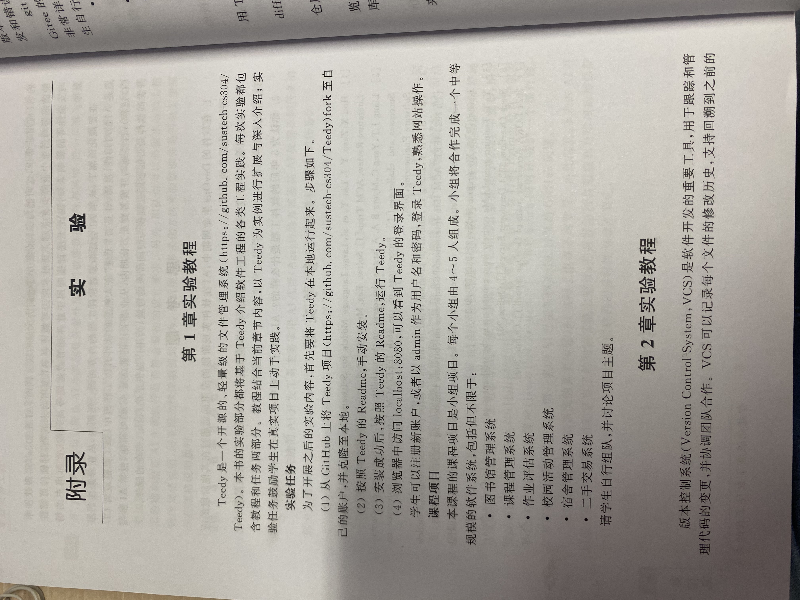
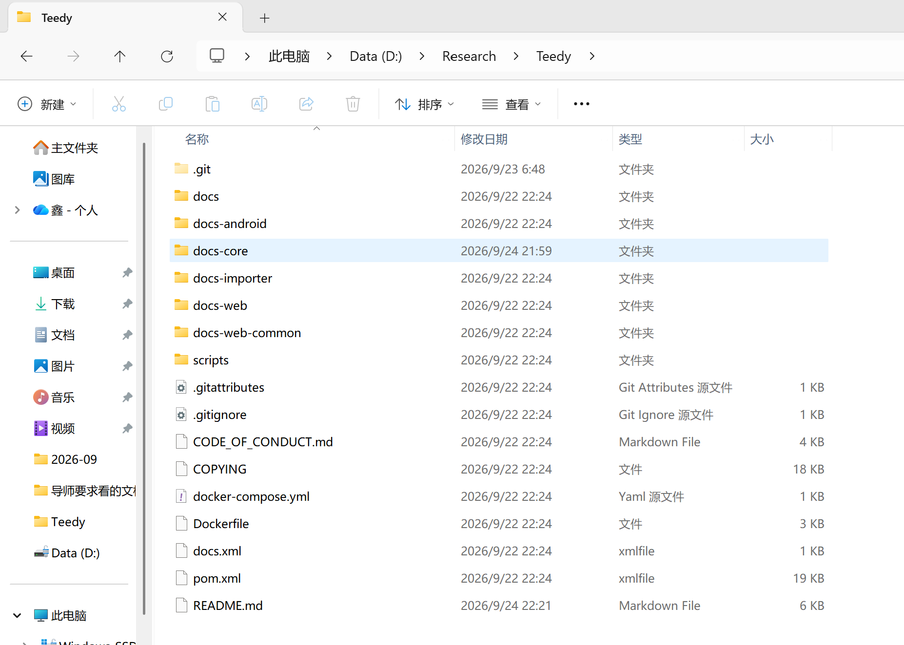
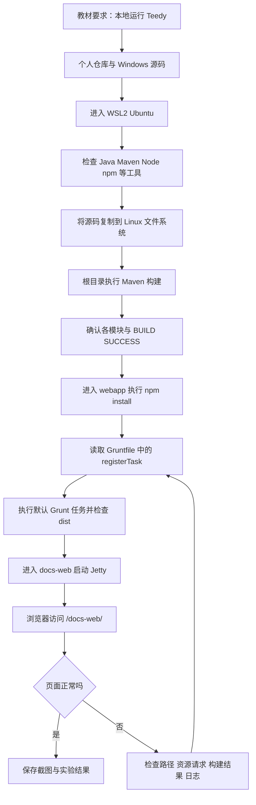
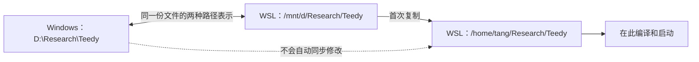
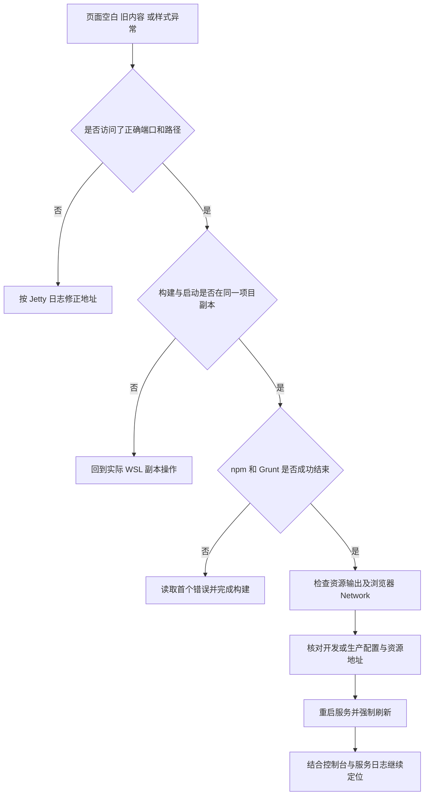

# 实验一：Teedy 源码构建、部署与运行

> 从获取开源项目到浏览器成功访问：记录 Windows 11 + WSL2 Ubuntu 环境下的真实操作、前端构建补充过程与问题排查。
>
> **已完成：Maven 多模块构建、npm 依赖安装、Grunt 前端构建、Jetty 服务启动、浏览器最终验证。**

## 目录

- [1. 实验目标与教材要求](#1-实验目标与教材要求)
- [2. 项目简介与目录认识](#2-项目简介与目录认识)
- [3. 实验环境与版本记录](#3-实验环境与版本记录)
- [4. 整体流程与路径关系](#4-整体流程与路径关系)
- [5. 详细实验步骤](#5-详细实验步骤)
- [6. 真实问题记录与排查方法](#6-真实问题记录与排查方法)
- [7. 实验结果与验收](#7-实验结果与验收)
- [8. 配图整理与提交 GitHub](#8-配图整理与提交-github)
- [9. 实验收获与后续工作](#9-实验收获与后续工作)
- [10. 参考资料](#10-参考资料)

## 1. 实验目标与教材要求

本实验对应教材附录中的“第 1 章实验教程”。目标是先把 Teedy 在本地运行起来，为后续的软件工程实践准备可用项目。

根据教材，实验一包含以下任务：

| 教材任务 | 本次实施方式 | 当前记录 |
| --- | --- | --- |
| 将课程 Teedy 项目 Fork 至个人账号并克隆到本地 | 使用个人仓库 `tangx2872-svg/Teedy`，Windows 本地已有项目 | 已有源码及个人仓库远程配置；Fork 关系可在 GitHub 仓库页面查看 |
| 按项目说明手动安装 | 在 WSL2 Ubuntu 中配置工具，执行 Maven 和前端构建 | 已完成 |
| 启动 Teedy | 在 `docs-web` 中执行 `mvn jetty:run` | 已完成 |
| 在浏览器中访问并熟悉操作 | 本次通过 `/docs-web/` 路径完成页面验证 | 页面验证已完成；具体登录及业务操作结果待补充 |

教材中的访问示例是 `localhost:8080`。本地源码的 Jetty 配置包含 `/docs-web` 上下文，因此本文使用 `http://localhost:8080/docs-web/`，实际端口仍以启动日志为准。

**教材实验要求照片：**



*图 1：本人提供的教材照片，用于说明实验要求。照片同时包含课程项目和下一章开头，本文只围绕实验一展开。*

本文区分三类信息：原 README 中保留的实验记录、此次核对的 Windows 本地源码配置，以及供复现参考的排查建议。建议项不表示本次都发生过相应故障。

## 2. 项目简介与目录认识

Teedy 是开源的轻量级文档管理系统。本次学习重点不是编写一个新的系统，而是理解如何获取、构建、运行和检查一个已有项目。[课程项目介绍](https://github.com/sustech-cs304/Teedy)

- 教材指定仓库：[sustech-cs304/Teedy](https://github.com/sustech-cs304/Teedy)。
- 本次个人实验仓库：[tangx2872-svg/Teedy](https://github.com/tangx2872-svg/Teedy)。
- Windows 项目目录：`D:\Research\Teedy`。
- WSL 主要构建目录：`/home/tang/Research/Teedy`。

### 2.1 本地目录截图



*图 2：本人提供的 Windows 项目目录截图，可见 `.git`、各源码模块、`pom.xml` 和原 README。它证明此处存在项目文件，不代表 WSL 构建产物或最新截图也在此目录。*

### 2.2 本次需要认识的文件

```text
Teedy/
├── .git/                         Git 仓库元数据
├── .gitignore                    控制哪些文件默认不提交
├── pom.xml                       Maven 父项目配置
├── docs-core/                    核心代码模块
├── docs-web-common/              Web 公共代码模块
├── docs-web/                     本次启动的 Web 模块
│   ├── pom.xml                   Jetty、开发及生产构建配置
│   └── src/main/webapp/
│       ├── package.json          前端依赖声明
│       ├── package-lock.json     前端依赖锁文件
│       ├── Gruntfile.js           前端构建任务
│       ├── src/                  前端源码
│       ├── node_modules/         npm 安装后生成的依赖目录
│       └── dist/                 Grunt 构建后生成的资源目录
├── docs-android/                 Android 相关代码，本次不展开
├── docs-importer/                导入工具相关代码，本次不展开
├── docs/images/                  本实验图片目录
└── README.md                     本实验说明
```

`node_modules/` 和 `dist/` 是安装或构建之后才会出现的目录，不要求原始源码中已经存在。Maven 构建结果通常在相应模块的 `target/` 中；这些目录和实验截图用途不同。

## 3. 实验环境与版本记录

### 3.1 原实验记录

操作系统为 **Windows 11 + WSL2 + Ubuntu**。原 README 记录了以下已配置工具版本，本文予以保留：

| 工具 | 原记录中的版本 | 本实验中的作用 |
| --- | --- | --- |
| Java | `25.0.4.1` | Java 编译和运行环境 |
| Maven | `3.9.12` | 多模块项目构建及依赖管理 |
| npm | `9.2.0` | 安装前端依赖 |
| Grunt | `1.6.1` | 执行前端资源构建 |
| Tesseract OCR | `5.5.0` | 与文字识别相关的外部工具 |
| FFmpeg | `8.0.1` | 与多媒体处理相关的外部工具 |
| Node.js | 原记录未单独列出 | 运行 npm 和 Grunt 所需的 JavaScript 环境 |
| Git、Ubuntu | 原记录未列出具体版本 | 源码管理与 Linux 环境 |

**版本表是历史记录，不是强制安装清单。** 原文没有逐项保留工具路径及终端输出，不能据此证明每个版本都来自同一个 WSL 会话。复现时需在实际运行 Maven 和 Grunt 的 WSL 终端重新检查，尤其不要混用 Windows 的 Java 与 WSL 的 Maven。

当前 Windows 副本的根 `pom.xml` 将 `maven.compiler.source` 和 `maven.compiler.target` 设为 `11`。这是编译配置，不能将原记录中的 Java 版本直接改写为 11，也不能仅凭该配置保证所有更高版本 JDK 都与旧插件兼容。

### 3.2 如何检查实际环境

以下命令在 **WSL Ubuntu 终端**执行：

```bash
cat /etc/os-release
command -v git java javac mvn node npm tesseract ffmpeg
git --version
java -version
javac -version
mvn -version
node --version
npm --version
tesseract --version
ffmpeg -version
```

检查重点：

1. 命令能否找到；出现 `command not found` 时先解决对应工具。
2. `mvn -version` 显示的 Java 版本及 Java home 是否符合预期。
3. `command -v` 显示的是否为准备使用的 Linux 工具路径。
4. Grunt 在前端依赖安装后，使用项目内的命令检查，见步骤 5.5。

首次搭建 Ubuntu 环境时，可参考课程仓库的依赖说明，按实际缺失项安装。例如：

```bash
sudo apt update
sudo apt install git default-jdk maven nodejs npm tesseract-ocr ffmpeg mediainfo
```

这是首次安装的参考命令，不是本次原始终端记录，也不会保证得到版本表中的版本。已配置好的环境不必为了复现说明重新安装。Grunt 使用下文的项目本地依赖；OCR 的语言包应按后续测试语言另行检查。[课程仓库环境要求](https://github.com/sustech-cs304/Teedy#native-installation)

## 4. 整体流程与路径关系

### 4.1 从源码到页面的完整流程



*图 3：按本次实验整理的操作流程图，不是终端运行截图。*

### 4.2 三个路径为什么容易混淆



*图 4：路径关系图。D 盘目录和 `/mnt/d/Research/Teedy` 指向同一份 Windows 文件；复制到 `/home/tang/Research/Teedy` 后得到另一份独立副本。*

因此，改了 D 盘里的文件，WSL 主目录里的服务不一定会变化。构建、启动和检查文件前都应确认所在目录。

## 5. 详细实验步骤

### 5.1 获取源码并检查仓库

**目的：** 确认使用的是自己的实验仓库，并认识项目根目录。

教材要求先在 GitHub 中打开课程仓库，使用 Fork 创建个人副本，再将个人副本克隆到本地。本次 Windows 项目已经位于 `D:\Research\Teedy`，无需再次克隆。

在 Windows PowerShell 中检查：

```powershell
Set-Location D:\Research\Teedy
git remote -v
git status
git branch --show-current
git rev-parse HEAD
```

**成功标志：** 能看到仓库状态、分支和提交号，`origin` 指向自己的实验仓库。本地 `.git/config` 中已记录 `https://github.com/tangx2872-svg/Teedy.git`。

首次准备且目标目录不存在时，才使用：

```powershell
New-Item -ItemType Directory -Force D:\Research
Set-Location D:\Research
git clone https://github.com/tangx2872-svg/Teedy.git
```

**可能问题：** `not a git repository` 通常说明目录不对或当前是没有 Git 元数据的源码压缩包；目标目录已存在时不要重复克隆到其中，也不要为解决提示直接删除已有项目。

### 5.2 进入 WSL 并准备 Linux 中的项目副本

**目的：** 将后续构建统一放在 WSL Ubuntu 中进行。

在 Windows PowerShell 中执行：

```powershell
wsl --list --verbose
wsl
```

如果默认进入的不是 Ubuntu，应进入已经配置好的 Ubuntu 发行版。进入后执行第 3 节的工具检查。

原实验将 D 盘项目复制到了 Linux 文件系统。**只有目标目录尚不存在时**才执行首次复制；下面的写法可避免误覆盖已有 WSL 工作目录：

```bash
mkdir -p ~/Research
if [ -e ~/Research/Teedy ]; then
  printf '%s\n' '目标已存在，保留现有目录，跳过复制。'
else
  cp -r /mnt/d/Research/Teedy ~/Research/
fi
cd ~/Research/Teedy
pwd
ls pom.xml docs-web/pom.xml
git status
```

**本次原记录中的 `pwd` 输出：**

```text
/home/tang/Research/Teedy
```

**成功标志：** 项目根目录存在 `pom.xml`，并能找到 `docs-web/pom.xml`。新机器的用户名可能不同，应使用自己的实际路径。

**可能问题：** 如果 `/mnt/d/Research/Teedy` 不存在，先检查 D 盘路径及 WSL 挂载情况；如果 WSL 目录已有修改，应保留并核对差异，不要再次整目录覆盖。

### 5.3 在项目根目录执行 Maven 构建

**目的：** 编译 Java 源码，构建各模块，并把模块制品安装到本地 Maven 仓库。

在 WSL 中执行：

```bash
cd ~/Research/Teedy
mvn clean -DskipTests install
```

| 命令部分 | 含义 |
| --- | --- |
| `clean` | 清理上一次 Maven 构建产物 |
| `install` | 完成构建，并将制品安装到本地 Maven 仓库，供后续模块解析依赖 |
| `-DskipTests` | 跳过测试执行；不能据此声称自动化测试已经通过 |

首次构建需要下载依赖，耗时会受网络和本地缓存影响。原 README 记录本次构建约 **07:46 min**，这不是每台机器的预期耗时。

原 README 记录以下模块均构建成功，项目版本为 `1.12-SNAPSHOT`：

| 模块名称 | 本次记录 |
| --- | --- |
| Docs Parent | SUCCESS |
| Docs Core | SUCCESS |
| Docs Web Commons | SUCCESS |
| Docs Web | SUCCESS |

**成功标志：** 最终输出 `BUILD SUCCESS`，而不是只看到前面某一个模块成功。

> 📷 待补真实截图：将包含模块汇总和 `BUILD SUCCESS` 的截图保存为 `docs/images/maven-build-success.png`。下面引用已预留，加入图片后去掉注释。

<!--

-->

**可能问题：** 依赖下载超时先检查网络和具体失败地址；Java 版本不匹配先检查 `mvn -version`；提示缺少项目内部模块时，确认是从根目录开始构建。不要仅截取错误最后一行，应查看第一个实质性错误及其上下文。

### 5.4 进入前端目录并执行 npm install

**目的：** 安装 Grunt 及构建所需的插件。

```bash
cd ~/Research/Teedy/docs-web/src/main/webapp
pwd
ls package.json package-lock.json Gruntfile.js
npm install
```

**成功标志：** 安装命令正常结束，所需开发依赖可用。依赖安装不是前端资源构建，接下来还要执行 Grunt。

本次曾出现 `npm WARN old lockfile`。npm 对旧锁文件可能补充获取元数据；**这类提示本身属于警告，不代表安装失败**。仍需结合最终输出及退出状态判断是否成功。[npm 锁文件说明](https://docs.npmjs.com/cli/v10/configuring-npm/package-lock-json/)

如需查看退出码，应在 `npm install` 后立刻执行 `echo $?`：`0` 表示上一条命令正常退出，非零表示失败。若中间先执行了其他命令，看到的就是其他命令的状态。

> 📷 可选截图：保存 `docs/images/npm-install.png`，展示实际安装结果及旧锁文件提示。

<!--

-->

**可能问题：** 前端工具位于 `devDependencies`，如果只安装生产依赖，会缺少 Grunt 或插件；不要因为提示旧锁文件就直接删除锁文件，或执行大范围强制升级。若锁文件发生改变，提交前查看差异。

### 5.5 检查任务定义，执行 Grunt 默认构建

**目的：** 将前端源码处理为项目定义的构建产物。

仍在 `docs-web/src/main/webapp` 目录执行：

```bash
grep -n -A 5 -B 2 'registerTask' Gruntfile.js
./node_modules/.bin/grunt --version
./node_modules/.bin/grunt --help
```

此次核对的 Windows 本地 Gruntfile 注册了 **`default` 默认任务**，未注册名为 `build` 的别名。默认任务依次涉及清理、Angular 注入标注、脚本合并、Less/CSS 处理、压缩、模板处理、复制资源、生成 HTML 引用、替换内容及生成 API 文档。

因此，在 WSL 副本确认任务定义相同后，执行：

```bash
./node_modules/.bin/grunt
```

不带任务名时会使用 `default`，**不要直接套用 `grunt build`**。使用项目内可执行文件，可以避免依赖全局 `grunt` 命令是否已加入 PATH。[Grunt 任务说明](https://gruntjs.com/creating-tasks)

原实验已完成前端构建；以上命令是根据当前本地源码核对后的复现写法，不冒充未保存的历史终端命令。

**构建后检查：**

```bash
ls -lh dist/index.html dist/docs.min.js dist/share.min.js dist/style/style.min.css
```

这些输出路径来自当前 Gruntfile。应确认任务完整执行成功、输出存在且时间合理；旧的 `dist/` 文件存在，并不意味着这一次构建成功。

> 📷 待补真实截图：保存 `docs/images/frontend-build.png`，尽量同时包含当前目录、实际 Grunt 命令和最终结果。

<!--

-->

**关于开发与生产模式：** 本地 `docs-web/pom.xml` 默认启用 `dev` 配置；`prod` 配置另外定义了 npm/Grunt 自动执行和使用 `dist` 打包 WAR 的流程。本文记录的是手动前端构建后使用 Jetty 的实验路径，不将 `prod` 中的 `--apiurl=api` 参数直接套用到当前命令。实际浏览器使用哪套资源，还需结合启动配置和资源请求核对。

### 5.6 启动 Jetty Web 服务

**目的：** 让浏览器可以通过 HTTP 访问 Teedy。

```bash
cd ~/Research/Teedy/docs-web
mvn jetty:run
```

**成功标志：** 日志显示 Web 应用正常启动，没有导致启动失败的错误，并能确认监听端口及上下文路径。本地配置中的上下文为 `/docs-web`。

运行后终端通常不会立即返回命令提示符，这是服务保持运行的正常表现。验证期间保持这个终端开启；查看文件或执行诊断命令可另开一个 WSL 终端。

如果之前已在另一个终端运行同一服务，先回到原终端用 `Ctrl+C` 停止，再重新启动，避免端口冲突。

> 📷 可选截图：保存 `docs/images/jetty-startup.png`，展示实际启动日志、端口与上下文信息。

<!--

-->

### 5.7 浏览器验证与教材登录要求

在 Windows 浏览器中打开：

```text
http://localhost:8080/docs-web/
```

如果启动日志显示其他端口，使用实际端口。访问 `http://localhost:8080/` 和访问 `/docs-web/` 不是同一个请求；根路径不显示页面不一定代表 Teedy 启动失败。

建议按以下顺序检查：

1. 页面是否能打开，是否持续空白或加载失败。
2. 样式和主要控件是否显示正常。
3. 如有异常，按 `F12` 查看 Network 中失败的请求及 Console 中的错误。
4. 按教材要求进行登录并熟悉网站操作，另行记录实际完成情况。

教材给出注册账号或使用初始 `admin` / `admin` 登录的方式。这是教材描述，不等于本次已经验证这些凭据有效；已有数据或账号修改后，应使用实际账号。是否支持注册也以当前页面和配置为准。

**本次已确认：Web 服务启动完成，浏览器最终能正常打开 Teedy 页面。** 当前记录未提供登录、上传和检索等操作的完整证据，因此不将这些功能写成已验证通过。

> 📷 待补真实截图：保存 `docs/images/teedy-running.png`，使用本次真正成功打开的页面。无需为配图切换到特定界面，也不要用网上的产品图替代个人运行结果。

<!--

-->

### 5.8 停止服务与下次再次运行

结束实验时，在运行 Jetty 的终端按 `Ctrl+C`。下次在环境和构建结果未变化的情况下，可先直接运行：

```bash
cd ~/Research/Teedy/docs-web
mvn jetty:run
```

如果修改了 Java 源码或模块依赖，应重新执行相应 Maven 构建；如果修改了前端源码，应重新执行前端构建。无需每次启动都重复复制源码或安装所有工具。

本地 `dev` 配置写有 `docs.home=../data/docs`。数据实际保存位置应结合运行日志和配置确认，不要为了重新构建直接删除数据目录；实验上传的数据也不要混入源码提交。

## 6. 真实问题记录与排查方法

### 6.1 本次发生：npm old lockfile 警告

| 项目 | 记录 |
| --- | --- |
| 出现阶段 | 前端目录中执行 `npm install` |
| 可见现象 | 出现 `npm WARN old lockfile` |
| 判断 | 警告与安装失败不同，需要看最终结果 |
| 本次结果 | 依赖安装完成，继续执行前端构建 |
| 学到的处理方式 | 保留错误上下文，检查退出状态，不因警告盲目删锁文件或升级依赖 |

### 6.2 本次发生：页面最初看似没有变化

实际过程是：**Maven 构建成功 → npm 安装完成 → 页面最初看似没有变化 → 补充完成前端构建 → 页面正常。**

这说明实验记录必须补上前端任务检查与构建步骤。现有记录没有完整保留浏览器资源请求及每次启动配置，不能进一步断言“肯定只因为缓存”或“所有开发模式都必须读取 dist”。

再次遇到类似问题时，可使用下图检查：



*图 5：排查建议图，不表示本次每个分支都发生过故障。*

### 6.3 其他可能遇到的问题

以下属于复现参考，不列为本次已经发生的错误。

| 现象 | 优先检查 | 建议处理 |
| --- | --- | --- |
| `java`、`mvn`、`npm` 找不到 | 工具是否安装在当前 WSL 环境；PATH 是否正确 | 先执行 `command -v`，仅补齐缺失工具 |
| Java 版本与预期不同 | `java -version` 和 `mvn -version` 是否一致 | 检查 Maven 实际使用的 Java home，不只看 Windows 终端 |
| `invalid target release`、类版本不兼容 | 报错要求的版本与实际 JDK | 对照当前源码、插件和错误信息选择兼容 JDK |
| Maven 下载依赖失败 | 第一个失败制品、仓库地址、网络或代理 | 修复连接后重新构建；不要一开始就清空整个本地仓库 |
| Maven 找不到内部模块 | 是否在根目录执行过完整 `install` | 回到根目录构建，再进入 Web 模块 |
| npm 长时间停留或下载失败 | 是否为网络请求、是否有真实错误 | 查看具体日志及 `npm config get registry`，保留锁文件排查 |
| Grunt 或插件找不到 | 是否在前端目录，是否安装了开发依赖 | 完成 `npm install`；若明确省略了开发依赖，可用 `npm install --include=dev` 补齐 |
| `Task "build" not found` | `registerTask` 中实际注册了什么 | 当前已核对的配置使用默认任务，运行本地 `grunt` |
| Grunt 部分步骤成功但最终报错 | 第一个失败任务及完整输出 | 处理该任务后重跑，不能仅凭存在 dist 判定成功 |
| Jetty 提示端口被占用 | 是否有旧服务仍运行 | 回到旧服务终端停止；不要随意终止不明进程 |
| HTTP 404 | 访问的是根路径还是 `/docs-web/`；应用是否部署成功 | 核对 URL、上下文及日志 |
| 连接被拒绝 | Jetty 是否启动或已经退出 | 先在 WSL 内检查服务，再检查 Windows 访问 |
| HTTP 500 | 同一时刻的服务端异常 | 查看 Jetty 错误栈；刷新页面不能修复服务端异常 |
| 页面没有样式、脚本 404 | Network 中失败资源的实际 URL | 核对构建产物、运行配置和资源路径 |
| 改了代码但页面不变 | 是否改在 D 盘副本，运行却在 WSL 主目录副本 | 先核对目录与文件，再考虑缓存 |
| 上传成功但 OCR 不正常 | OCR 工具、语言包、应用日志 | 单独检查 `tesseract --list-langs`，不把首页成功等同于 OCR 成功 |
| GitHub README 图片不显示 | 文件是否提交、大小写是否一致、是否被忽略 | 按第 8 节修正图片跟踪规则 |

必要时在第二个 WSL 终端进行只读检查：

```bash
# 查看常用端口监听情况，端口不同时替换为实际值
ss -ltnp | grep ':8080'

# 在 WSL 内请求页面，记录 HTTP 状态；重定向会被跟随
curl -sS -L -o /dev/null -w 'HTTP %{http_code}\n' http://localhost:8080/docs-web/
```

HTTP 状态有助于区分连接问题和应用响应问题，但 HTTP 200 也不保证脚本、样式或全部业务功能正常，仍需浏览器验证。

## 7. 实验结果与验收

| 验收项 | 状态 | 依据或补充 |
| --- | --- | --- |
| 本地 Teedy 源码与个人仓库配置 | 已完成 | 原记录、目录截图、本地远程配置 |
| WSL2 Ubuntu 环境与依赖配置 | 已完成 | 原 README 记录；具体工具路径可进一步补录 |
| 将项目复制到 Linux 文件系统 | 已完成 | 原记录路径 `/home/tang/Research/Teedy` |
| Maven 多模块构建 | 已完成 | 原记录各模块 SUCCESS，约 07:46 min |
| npm 依赖安装 | 已完成 | 实验过程记录，曾有 old lockfile 警告 |
| Grunt 前端构建 | 已完成 | 实验过程记录；默认任务已由 Windows 源码核对 |
| Jetty Web 服务启动 | 已完成 | 后续实验结果已确认，修正原 README 过时勾选状态 |
| 浏览器最终页面验证 | 已完成 | 后续实验结果已确认，页面正常 |
| 登录并熟悉具体操作 | 待补操作记录 | 教材要求之一，不从页面可见推定完成 |
| 自动化测试 | 本次未验证 | Maven 使用了 `-DskipTests` |

本次已经完成“将 Teedy 构建并运行起来”的目标。构建成功、服务启动成功、页面访问成功是不同层次的结果；上传、检索、OCR 等应在实际测试后另行记录。

## 8. 配图整理与提交 GitHub

### 8.1 已有图片与待补图片

本 README 已实际引用两张本人提供的图片，并绘制了三张 Mermaid 图。没有使用网上运行页面冒充本次实验截图。

| 文件 | 当前状态 | 建议内容 |
| --- | --- | --- |
| `docs/images/experiment-01-requirements.jpg` | 已加入 | 本次提供的教材实验要求照片 |
| `docs/images/teedy-project-directory.png` | 已加入 | 本次提供的 D 盘项目目录截图 |
| `docs/images/maven-build-success.png` | 待补 | 真实 Maven 模块汇总及 BUILD SUCCESS |
| `docs/images/npm-install.png` | 可选补充 | 真实依赖安装结果及警告 |
| `docs/images/frontend-build.png` | 待补 | 真实 Grunt 命令及构建结果 |
| `docs/images/jetty-startup.png` | 可选补充 | 真实服务启动日志 |
| `docs/images/teedy-running.png` | 待补 | 真实浏览器最终页面 |

待补图片的引用目前放在 HTML 注释中，避免 GitHub 显示损坏图片。添加对应文件后，去掉图片语句上下的 `<!--` 与 `-->` 即可显示，例如：

```markdown

```

截图以清晰、与步骤对应为主；展示实际信息即可，不补造命令输出。公开前检查是否包含私人文档、账号或其他不适合公开的信息。

### 8.2 处理本仓库的图片忽略规则

本次检查发现，现有根 `.gitignore` 包含：

```gitignore
docs/*
!docs/.gitkeep
```

因此，仅把截图放到 `docs/images/`，Git 默认仍可能忽略它们。应在根 `.gitignore` **末尾**追加以下两行，保留其他规则：

```gitignore
# Track experiment illustrations
!docs/images/
!docs/images/**
```

可在仓库根目录检查：

```bash
git status --short --untracked-files=all
git check-ignore -v docs/images/experiment-01-requirements.jpg
```

`check-ignore -v` 用于查看匹配规则；若显示以 `!` 开头的放行规则，不要误当成仍被排除。最终以图片能否正常暂存及暂存文件清单为准。

### 8.3 整理与提交

本次交付包结构如下，README 和图片应一起放入准备提交的 Teedy 仓库：

```text
README.md
docs/
└── images/
    ├── experiment-01-requirements.jpg
    └── teedy-project-directory.png
```

待补截图以后继续放入同一图片目录。若已有 README 含其他需要保留的说明，应先比较内容再替换；D 盘与 WSL 副本需要自行确认哪一份用于提交。

在准备提交的仓库中，完成 `.gitignore` 调整后执行：

```bash
git diff -- README.md .gitignore
git add README.md .gitignore docs/images/
git diff --cached --stat
git diff --cached --name-only
```

确认暂存的是本次文档与图片，没有运行数据、依赖目录或其他无关文件，再自行提交：

```bash
git commit -m "docs: document Teedy experiment 1 with illustrations"
```

推送前用 `git branch --show-current` 和 `git remote -v` 确认目标；若当前分支已经配置好对应的远程跟踪关系，可执行 `git push`。推送后打开 GitHub README 检查图片和 Mermaid 是否正常显示。本文仅提供操作说明，不表示这些 Git 操作已执行。

## 9. 实验收获与后续工作

### 实验收获

1. **认识开源项目的完整运行链路。** 获取源码只是开始，还需要依赖、编译、前端处理、启动和页面验证。
2. **理解 Maven 多模块构建。** 从父项目构建能够处理模块之间的依赖，不能只关注最后启动的 Web 模块。
3. **区分依赖安装与前端构建。** `npm install` 准备工具，Grunt 执行项目定义的资源处理。
4. **学会读取配置确定命令。** 检查 `registerTask`、Maven profile 和上下文路径，比套用其他项目的命令更可靠。
5. **学会判断警告与失败。** `old lockfile` 不等于构建失败，应该结合完整日志与最终状态判断。
6. **理解 Windows 与 WSL 的文件关系。** 挂载路径与复制后的 Linux 路径不同，修改和运行必须对应同一副本。
7. **形成可核对的实验记录。** 用具体命令、阶段结果和真实截图说明工作，而不是只写“运行成功”。

### 后续可做事项

- [ ] 补齐 Maven、Grunt 和最终浏览器页面的真实截图。
- [ ] 在同一次 WSL 会话记录各工具版本、路径、Ubuntu 版本及源码提交号。
- [ ] 按教材完成或补录登录、浏览页面和熟悉网站操作的结果。
- [ ] 使用不含敏感信息的样例文档验证上传、查看和检索。
- [ ] 如需 OCR 验证，单独记录工具、语言包与识别结果。
- [ ] 在具备测试环境后运行自动化测试，并记录结果。
- [ ] 按本文从头复核一次流程，补齐与当前 WSL 配置的差异。

**Jetty 启动和浏览器最终验证已经完成，不再列为待完成项。**

## 10. 参考资料

- 本人提供的教材“第 1 章实验教程”照片，以及原始实验 README。
- [课程 Teedy 仓库与安装说明](https://github.com/sustech-cs304/Teedy)。
- [个人实验仓库](https://github.com/tangx2872-svg/Teedy)。
- [npm：package-lock.json 与旧锁文件处理](https://docs.npmjs.com/cli/v10/configuring-npm/package-lock-json/)。
- [Grunt：任务注册与默认任务](https://gruntjs.com/creating-tasks)。
- 本地核对文件：[父项目配置](pom.xml)、[Web 模块配置](docs-web/pom.xml)、[前端任务](docs-web/src/main/webapp/Gruntfile.js)、[前端依赖](docs-web/src/main/webapp/package.json)。

本文件是个人实验记录。项目源码的许可说明请保留并参阅仓库中的 [COPYING](COPYING)。
